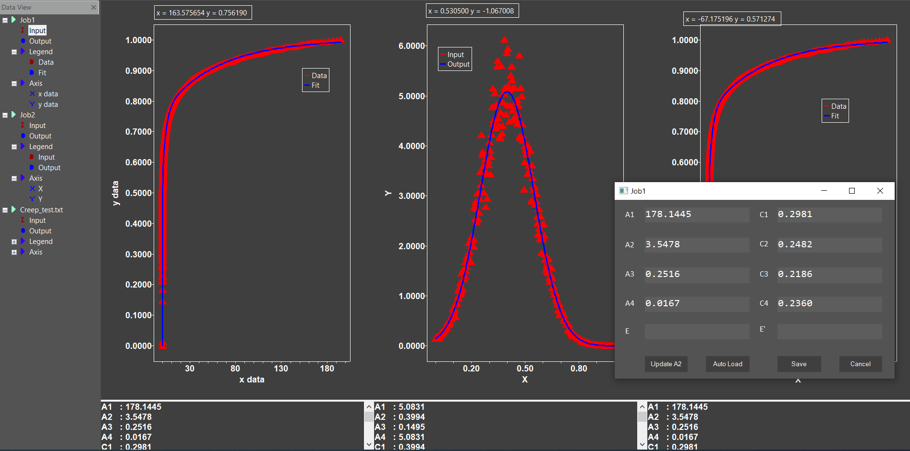

# Graphical-Interface-for-the-Data-Analysis

## Overview

A graphic interface is developed with C++ 17 to assist the experimental data analysis from dynamical mechanics analysis (DMA) measurements with the functions of importing data, data linear fitting with GSL, figure plotting with wxWidgets, and data outputting to files and images.

## Features
- Import experimental data from local disk or server
- Data linear fitting with GSL
- Figure plotting
- Layout multiple plotting graph horizontally to compare and analyze data.
- Export output data
- Export plotting graph
- Save and Open project
- Produce rotating logs
- Activate software with a registration key
- A Node.js server running on Ubuntu to supply data service 

## Dependency    
- **GSL - GNU Scientific Library** ([Link](https://www.gnu.org/software/gsl/))
- **wxWidgets** (Version 3.1.4) ([Link](https://www.wxwidgets.org/))
- **Json For C++** ([Link](https://github.com/nlohmann/json/))
- **curl** ([Link](https://curl.se/libcurl/))

### Interactive window 
Supporting operations like zooming in, zooming out, coordinates tracing, span moving.

  

- Supported Mouse commands:
  - Left button down + Mark area: Rectangular zoom
  - Right button down + Move: Pan (Move)
  - Wheel: Vertical scroll
  - Wheel + SHIFT: Horizontal scroll
  - Wheel + CTRL: Zoom in/out
- Supported Touchpad commands:
  - Two fingers drag: Scroll up/down
  - Two fingers drag + SHIFT: Scroll left/right
  - Two fingers pinch in: Zoom in
  - Two fingers stretch out: Zoom out

### Save project in json format
Save the task in a project that can be imported directly next time
```js
 {
   "00aa00d800a900cf003c004a006f0090":{
      "fitting":"C:\\JobResults\\Jobs\\Job2\\fitting.txt",
      "input":"C:\\JobResults\\Jobs\\Job2\\input.txt",
      "output":"C:\\JobResults\\Jobs\\Job2\\output.txt",
      "title":"Job2"
   },
   "00af002800c500e100e7007b00e20029":{
      "fitting":"C:\\JobResults\\Jobs\\Creep_test.txt\\fitting.txt",
      "input":"C:\\JobResults\\Jobs\\Creep_test.txt\\input.txt",
      "output":"C:\\JobResults\\Jobs\\Creep_test.txt\\output.txt",
      "title":"Creep_test.txt"
   },
   "00b300f600da000a004c00cf000500e0":{
      "fitting":"C:\\JobResults\\Jobs\\Job1\\fitting.txt",
      "input":"C:\\JobResults\\Jobs\\Job1\\input.txt",
      "output":"C:\\JobResults\\Jobs\\Job1\\output.txt",
      "title":"Job1"
   },
   "ids":[
      "00b300f600da000a004c00cf000500e0",
      "00aa00d800a900cf003c004a006f0090",
      "00af002800c500e100e7007b00e20029"
   ]
}
``` 
### Horizontally layout
Layout multiple plotting graph horizontally to compare and analyze data


### Fitting logs
Log the detailed fitting process.
```
2021-01-30  20:59:06:987 -INFO- begin to fit, parameters > A1:100, A2:3.5478, A3:0.1, A4:0.001, C1:0.1, C2:0.1, C3:0.1, C4:0.1
2021-01-30  20:59:06:987 -INFO- iter  0: A1=100.0000, A3=0.1000, A4=0.0010, C1=0.1000, C3=0.1000, C4=0.1000 C2=0.1000, cond(J) =      nan, |f(x)| = 10.1416 
2021-01-30  20:59:06:989 -INFO- iter  1: A1=119.7394, A3=0.1514, A4=0.0029, C1=0.1119, C3=0.1182, C4=0.2733 C2=0.1139, cond(J) = 73396.6458, |f(x)| = 8.8925 
2021-01-30  20:59:06:989 -INFO- iter  2: A1=156.8983, A3=0.2377, A4=0.0047, C1=0.1385, C3=0.1555, C4=0.4121 C2=0.1444, cond(J) = 180550.7464, |f(x)| = 6.5600 
2021-01-30  20:59:06:989 -INFO- iter  3: A1=207.4810, A3=0.3488, A4=0.0065, C1=0.1800, C3=0.2056, C4=0.5192 C2=0.1903, cond(J) = 258189.9884, |f(x)| = 3.4415 
2021-01-30  20:59:06:990 -INFO- iter  4: A1=259.0984, A3=0.4409, A4=0.0071, C1=0.2206, C3=0.2404, C4=0.5282 C2=0.2291, cond(J) = 304709.5674, |f(x)| = 1.3470 
2021-01-30  20:59:06:990 -INFO- iter  5: A1=291.0666, A3=0.4552, A4=0.0066, C1=0.2506, C3=0.2482, C4=0.4621 C2=0.2463, cond(J) = 326618.0270, |f(x)| = 0.6635 
2021-01-30  20:59:06:991 -INFO- iter  6: A1=274.6173, A3=0.3589, A4=0.0065, C1=0.2743, C3=0.2425, C4=0.3968 C2=0.2497, cond(J) = 313033.2051, |f(x)| = 0.4291 
2021-01-30  20:59:06:991 -INFO- iter  7: A1=224.7379, A3=0.2281, A4=0.0070, C1=0.2902, C3=0.2395, C4=0.3300 C2=0.2553, cond(J) = 228046.9665, |f(x)| = 0.2810 
2021-01-30  20:59:06:991 -INFO- iter  8: A1=200.7802, A3=0.1985, A4=0.0081, C1=0.2939, C3=0.2459, C4=0.2704 C2=0.2597, cond(J) = 127924.7058, |f(x)| = 0.2371 
2021-01-30  20:59:06:992 -INFO- iter  9: A1=191.5349, A3=0.2014, A4=0.0103, C1=0.2949, C3=0.2422, C4=0.2397 C2=0.2586, cond(J) = 79498.1862, |f(x)| = 0.2279 
2021-01-30  20:59:06:992 -INFO- iter 10: A1=186.5155, A3=0.2174, A4=0.0130, C1=0.2960, C3=0.2323, C4=0.2306 C2=0.2553, cond(J) = 54491.9397, |f(x)| = 0.2208 
2021-01-30  20:59:06:992 -INFO- iter 11: A1=183.1675, A3=0.2341, A4=0.0150, C1=0.2969, C3=0.2246, C4=0.2333 C2=0.2520, cond(J) = 40832.6243, |f(x)| = 0.2163 
2021-01-30  20:59:06:993 -INFO- iter 12: A1=180.8982, A3=0.2455, A4=0.0162, C1=0.2976, C3=0.2203, C4=0.2350 C2=0.2497, cond(J) = 35287.0740, |f(x)| = 0.2152 
2021-01-30  20:59:06:993 -INFO- iter 13: A1=179.5585, A3=0.2499, A4=0.0166, C1=0.2979, C3=0.2190, C4=0.2358 C2=0.2488, cond(J) = 32368.8509, |f(x)| = 0.2151 
2021-01-30  20:59:06:994 -INFO- iter 14: A1=178.8489, A3=0.2511, A4=0.0167, C1=0.2980, C3=0.2187, C4=0.2360 C2=0.2484, cond(J) = 31340.3889, |f(x)| = 0.2150 
2021-01-30  20:59:06:994 -INFO- iter 15: A1=178.4914, A3=0.2514, A4=0.0167, C1=0.2981, C3=0.2186, C4=0.2360 C2=0.2483, cond(J) = 30997.4456, |f(x)| = 0.2150 
2021-01-30  20:59:06:994 -INFO- iter 16: A1=178.3146, A3=0.2515, A4=0.0167, C1=0.2981, C3=0.2186, C4=0.2360 C2=0.2483, cond(J) = 30871.9968, |f(x)| = 0.2150 
2021-01-30  20:59:06:995 -INFO- iter 17: A1=178.2278, A3=0.2515, A4=0.0167, C1=0.2981, C3=0.2186, C4=0.2360 C2=0.2482, cond(J) = 30819.3094, |f(x)| = 0.2150 
2021-01-30  20:59:06:995 -INFO- iter 18: A1=178.1853, A3=0.2516, A4=0.0167, C1=0.2981, C3=0.2186, C4=0.2360 C2=0.2482, cond(J) = 30795.1403, |f(x)| = 0.2150 
2021-01-30  20:59:06:995 -INFO- iter 19: A1=178.1644, A3=0.2516, A4=0.0167, C1=0.2981, C3=0.2186, C4=0.2360 C2=0.2482, cond(J) = 30783.6028, |f(x)| = 0.2150 
2021-01-30  20:59:06:996 -INFO- iter 20: A1=178.1542, A3=0.2516, A4=0.0167, C1=0.2981, C3=0.2186, C4=0.2360 C2=0.2482, cond(J) = 30778.0078, |f(x)| = 0.2150 
2021-01-30  20:59:06:996 -INFO- iter 21: A1=178.1492, A3=0.2516, A4=0.0167, C1=0.2981, C3=0.2186, C4=0.2360 C2=0.2482, cond(J) = 30775.2785, |f(x)| = 0.2150 
2021-01-30  20:59:06:997 -INFO- iter 22: A1=178.1468, A3=0.2516, A4=0.0167, C1=0.2981, C3=0.2186, C4=0.2360 C2=0.2482, cond(J) = 30773.9440, |f(x)| = 0.2150 
2021-01-30  20:59:06:997 -INFO- iter 23: A1=178.1456, A3=0.2516, A4=0.0167, C1=0.2981, C3=0.2186, C4=0.2360 C2=0.2482, cond(J) = 30773.2911, |f(x)| = 0.2150 
2021-01-30  20:59:06:998 -INFO- iter 24: A1=178.1450, A3=0.2516, A4=0.0167, C1=0.2981, C3=0.2186, C4=0.2360 C2=0.2482, cond(J) = 30772.9715, |f(x)| = 0.2150 
2021-01-30  20:59:06:998 -INFO- iter 25: A1=178.1447, A3=0.2516, A4=0.0167, C1=0.2981, C3=0.2186, C4=0.2360 C2=0.2482, cond(J) = 30772.8150, |f(x)| = 0.2150 
2021-01-30  20:59:06:998 -INFO- iter 26: A1=178.1446, A3=0.2516, A4=0.0167, C1=0.2981, C3=0.2186, C4=0.2360 C2=0.2482, cond(J) = 30772.7385, |f(x)| = 0.2150 
2021-01-30  20:59:06:999 -INFO- iter 27: A1=178.1445, A3=0.2516, A4=0.0167, C1=0.2981, C3=0.2186, C4=0.2360 C2=0.2482, cond(J) = 30772.7010, |f(x)| = 0.2150 
2021-01-30  20:59:06:999 -INFO- iter 28: A1=178.1445, A3=0.2516, A4=0.0167, C1=0.2981, C3=0.2186, C4=0.2360 C2=0.2482, cond(J) = 30772.6826, |f(x)| = 0.2150 
2021-01-30  20:59:06:999 -INFO- NITER = 28, NFEV = 34, NJEV = 29, NAEV = 33, initial cost = 1.028516134852e+02, final cost = 4.624229910482e-02, final x = (1.781444872986e+02, 2.515702104408e-01, 1.672385e-02), final cond(J) = 3.077268260701e+04 
2021-01-30  20:59:06:999 -INFO- end to fit, outputs > A1:178.144, A2:3.5478, A3:0.25157, A4:0.0167238, C1:0.298149, C2:0.248224, C3:0.218609, C4:0.236041
```
